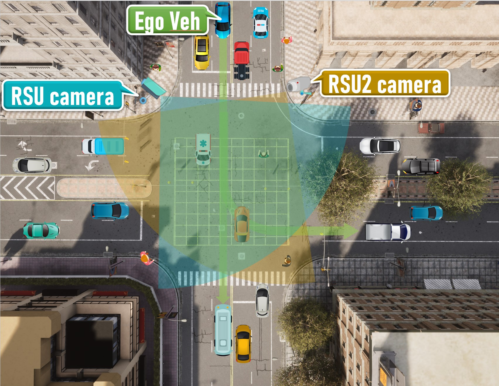
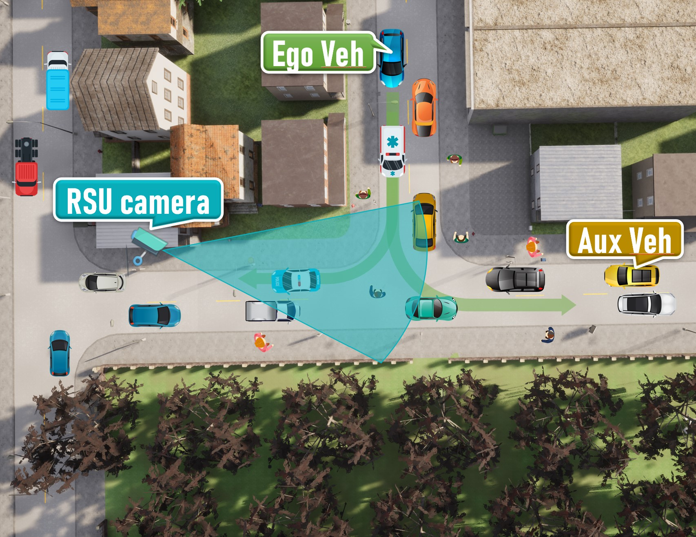
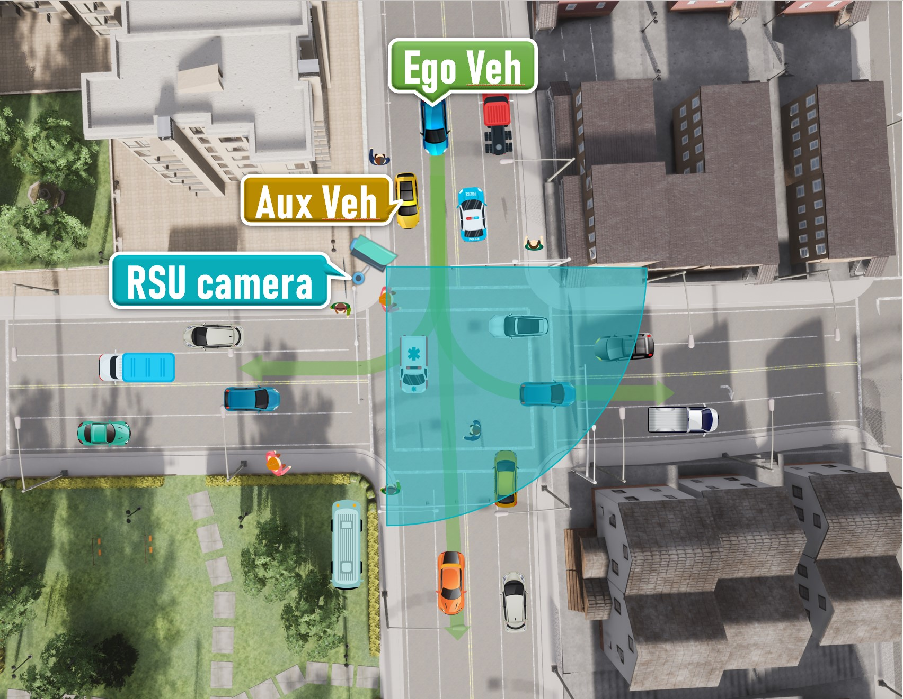
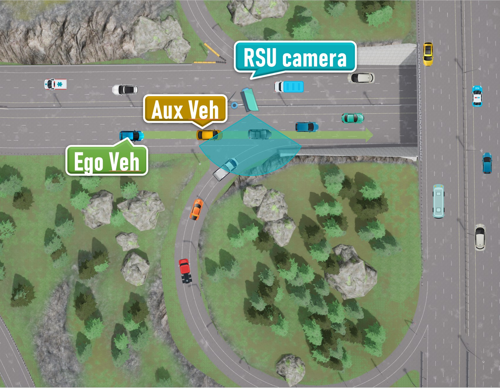
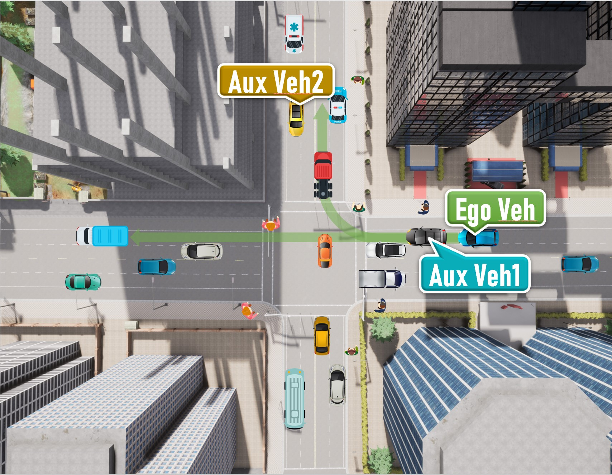
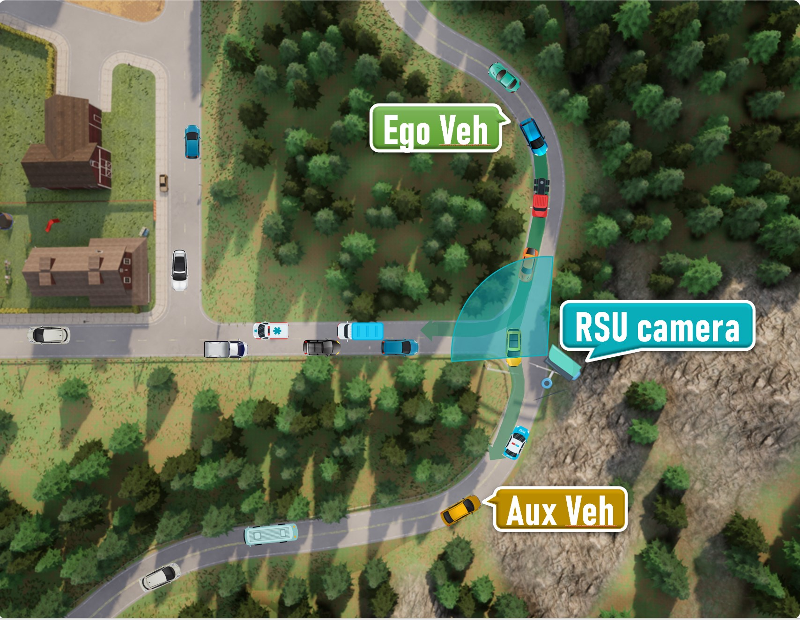
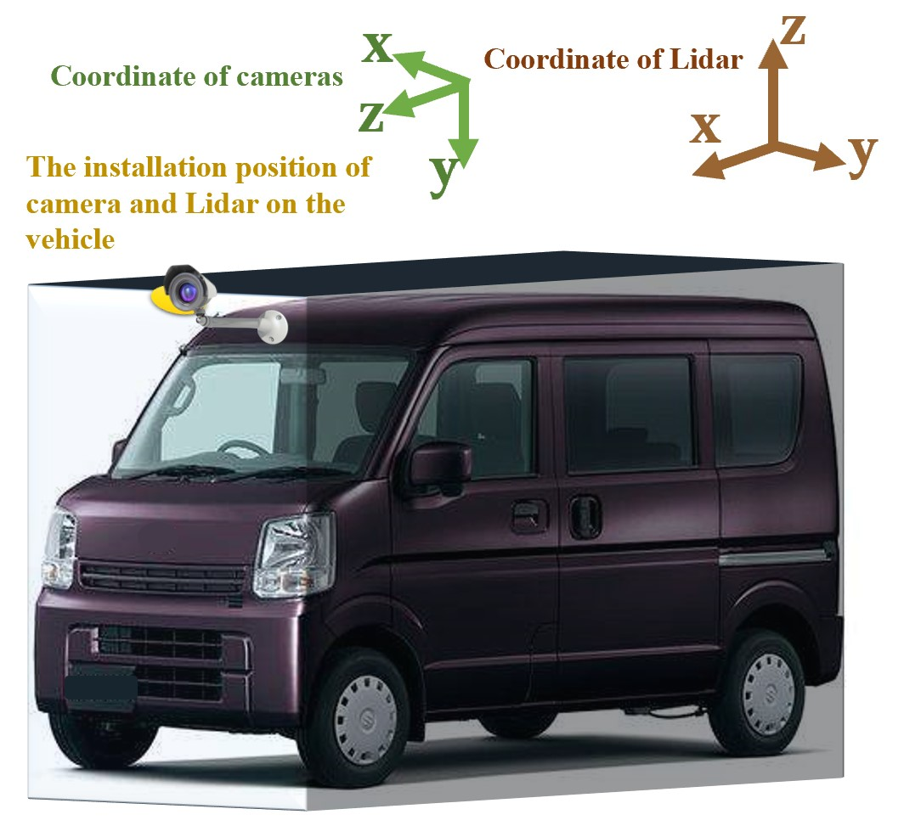

# DOLPHINS

## Catalogue

*   [Overview](#overview)

*   [Setup](#setup)

    *   [Scene Setup](#scene-setup)
    *   [Sensors Setup](#sensors-setup)

*   [Usage](#usage)

    *   [Data Format Description](#data-format-description)

    *   [Annotations](#annotations)

        *   [The label files](#the-label-files)
        *   [The loc files](#the-loc-files)

    *   [Calibration](#calibration)

        *   [coordinate transformation between cameras](#coordinate-transformation-between-cameras)
        *   [coordinate transformation between LiDAR and camera](#coordinate-transformation-between-lidar-and-camera)

*   [Contact](#contact)

# Overview

DOLPHINS, Dataset for cOLlaborative Perception enabled Harmonious and INterconnected Self-driving, provides visual and LiDAR information collected from different perspectives when the car is moving. We use the [CARLA simulator](http://carla.org/ "Carla simulator") to complete this work, which can provide us with realistic environment modeling, as well as dynamics and sensors simulations of various vehicle.

Our dataset contains 6 different scenarios, including urban intersections, ramps, and highways. Considering the actual driving situation, we meticulously set 3 different viewpoints for each scenario, which will be explained later. For each viewpoint in each scenario, our dataset contains more than 6000 images with the size of 1920 × 1080. Each image includes 3-10 vehicles, and for reasonable scenarios, their images also consist of 1-5 pedestrians. The annotations per image include the following: (i) 2D bounding box of the object in the image, (ii) 3D object dimensions and location, (iii) the value of alpha and rotation y which are defined in  [the KITTI Vision Benchmark](http://www.cvlibs.net/datasets/kitti/eval_3dobject.php "the KITTI Vision Benchmark"). Besides, to increase the practicability of our dataset, we also provide the corresponding point clouds and calibration files, and the labels are formatted as that of the KITTI Vision Benchmark.

# Setup

## **Scene Setup**

We select six typical autonomous driving scenarios and several common types of weather from the preset scenarios of the CARLA simulator.&#x20;

In each scenario, we set three units (RSU or vehicles) to collect both images and point clouds information. (The Sensors Setup on each unit will be specified below.) The first unit is attached to the vehicle we drive, namely, the ego vehicle, that provides us with the main viewpoint. In each simulation round, we initialized it at a specific location. The other two units will also be set up at appropriate positions. They are set on RSUs or auxiliary vehicles selected from the scenario and initialized at a specially designated point with a stochastic vehicle model.&#x20;

In each scenario, our ego vehicle chooses a specific route. At the same time, we collect the information of all sensors synchronously. After the vehicle passes through the specific scenario, we wind up the current simulation round, reinitialize the scenario and start a new one. During each round, except for our ego vehicle and the possible auxiliary vehicle, all other traffic participants appear on a reasonable position randomly at the beginning and choose their route by themselves freely.

The following shows our diagrammatic sketch of each scenario. All ego vehicles are driving along a pre-defined route (*green arrows*), while each RSU camera is settled with a fixed direction and range (*blue or brown sector mark*). We also mark positions where the ego vehicle or possible auxiliary vehicles are initialized.

*   **Scenario 01**

    An intersection scenario
<center>
<figure>

</figure>
</center>

*   **Scenario 02**

    A T-junction with soft rain
<center>
<figure>

</figure>
</center>

*   **Scenario 03**

    Crossroads with a steep ramp
<center>
<figure>

</figure>
</center>


*   **Scenario 04**

    Expressway with a right merging lane
<center>
<figure>

</figure>
</center>


*   **Scenario 05**

    An intersection scenario
<center>
<figure>

</figure>
</center>


*   **Scenario 06**

    A mountain road
<center>
<figure>

</figure>
</center>


## **Sensors Setup**

All sensors (including RGB cameras and LiDARs) are set on vehicles as well as road side units (RSUs). All traffic participants move on their own and the data of all sensors are recorded every 0.5 seconds in the simulation environment. we equipped each unit with the following sensors :

*   Parameters of sensors on different  units :

<table>
	<tr>
	    <th>Sensor type</th>
	    <th>Parameter atttributes</th>
	    <th>RSU</th>  
        <th>Vehicle</th>
	</tr >
	<tr >
	    <td rowspan="3">RGB Camera</td>
	    <td>Horizontal field of view in degrees</td>
	    <td>90</td>
        <td>90</td>
	</tr>
	<tr>
	    <td>Resolution</td>
	    <td>1920&times1080</td>
        <td>1920&times1080</td>
	</tr>
	<tr>
	    <td>Height in meters</td>
	    <td>4</td>
        <td>0.3+h<sub>veh</sub><sup>*</sup>
	</tr>
        <tr >
	    <td rowspan="7">LiDAR</td>
	    <td>Number of lasers</td>
	    <td>64</td>
        <td>64</td>
	</tr>
	<tr>
	    <td>Maximum distance to measure in meters</td>
	    <td>200</td>
        <td>200</td>
	</tr>
	<tr><td>Points generated by all lasers per second</td>
	    <td>2.56&times10<sup>6</sup></td>
        <td>2.56&times10<sup>6</sup></td>
	</tr>
	<tr>
	    <td>LiDAR rotation frequency</td>
	    <td>20</td>
        <td>20</td>
	</tr>
	<tr>
	    <td>Angle in degrees of the highest laser</td>
	    <td>0</td>
        <td>2</td>
	</tr>
	<tr>
	    <td>Angle in degrees of the lowest laser</td>
	    <td>-40</td>
        <td>-24.8</td>
	</tr>
	<tr>
	    <td >General proportion of points that are randomly dropped</td>
	    <td>0.1</td>
        <td>0.1</td>
	</tr>	
</table>

*height of the ego vehicle


*   Installation of sensors :

    This figure shows our fully equipped unit (take OBU as an example) and the coordinate system of each sensor :

<center>
<figure>

</figure>
</center>


we install the camera and LiDAR on the same point which is above the front of the car as the sketch shows.

# Usage

## **Data Format Description**

The data for training and testing can be found in the corresponding folders.

```纯文本
Town0x/
└── test/
└── train/
```

The sub-folders are structured as follows :

```text
- image_2/ contains the color camera images obtained from the ego vehicle (png)
- image_r/ contains the color camera images obtained from unit 1 (png)
- image_rc/ contains the color camera images obtained from unit 2 (png)
- label_2/ contains the labels of traffic participants within the visible range of the RGB camera from the ego vehicle (plain text files)
- label_r/ contains the labels of traffic participants within the visible range of the RGB camera from unit 1 (plain text files)
- label_rc/ contains the labels of traffic participants within the visible range of the RGB camera from unit 2 (plain text files)
- label_C_2/ contains the labels of traffic participants within 100 meters in front of or behind the ego vehicle, and 40 meters in the left and right directions (plain text files)
- label_C_r/ the same as label_C_2, but the data is recorded from unit 1 (plain text files)
- label_C_rc/ the same as label_C_2, but the data is recorded from unit 2 (plain text files)
- velodyne_2/ contains the point cloud data obtained from the ego vehicle (bin)
- velodyne_r/ contains the point cloud data obtained from unit 1 (bin)
- velodyne_rc/ contains the point cloud data obtained from unit 2 (bin)
- loc/ contains the location information of the ego vehicle and auxiliary vehicles (plain text files)
- calib/ contains the calibration for all cameras and LiDARs (plain text file)
```

> For simplicity，when the scenario has two RSUs or auxiliary vehicles, *unit 1* represent *RSU1* or *aux\_veh 1* while *unit 2* represent *RSU2* or *aux\_veh 2* ; when it has only one RSU and one auxiliary vehicle, *unit 1* and *unit 2* indicate *RSU* and *aux\_veh* repectively.

## **Annotations**

### **The label files**

The label files have similar format as that of [the KITTI Vision Benchmark](http://www.cvlibs.net/datasets/kitti/eval_3dobject.php "the KITTI Vision Benchmark"), which means that the tools developed for KITTI can also be used to extract and evaluate this dataset.

Compared with KITTI, our dataset do not provide the *truncated, occluded, and alpha* values at present (We represent them with their default values). We will further solidify it in the future.&#x20;

In the label files all values (numerical or strings) are separated via spaces, each row corresponds to one object. The 15 columns represent (It is almost exactly the same as KITTI, so if you are familiar with KITTI, you can skip this part)

| Values | Name        | Description                                                                                                                                              |
| ------ | ----------- | -------------------------------------------------------------------------------------------------------------------------------------------------------- |
| 1      | type        | Describes the type of object: 'Car', 'Pedestrian'                                                                                                        |
| 1      | truncated   | Float from 0 (non-truncated) to 1 (truncated), where truncated refers to the object leaving image boundaries, still all at default value 0               |
| 1      | occluded    | Integer (0,1,2,3) indicating occlusion state: 0 = fully visible, 1 = partly occluded, 2 = largely occluded, 3 = unknown, still all at default value 0 |
| 1      | alpha       | Observation angle of object, ranging \[-pi..pi], still all at default value -10                                                                          |
| 4      | bbox        | 2D bounding box of object in the image (0-based index): contains left, top, right, bottom pixel coordinates                                              |
| 3      | dimensions  | 3D object dimensions: height, length, width (in meters)                                                                                                  |
| 3      | location    | 3D object location x,y,z in camera coordinates (in meters)                                                                                               |
| 1      | rotation\_y | Rotation r\_y around Y-axis in camera coordinates \[-pi..pi]                                                                                             |
| 1      | score       | Only for results: Float, indicating confidence in detection, needed for p/r curves, higher is better.                                                    |


### **The loc files**

we provide the location and rotation (Euler angle) information of cameras on the *ego vehicle* and *auxiliary vehicles.*&#x20;

In the loc files all values are separated via spaces. The first row corresponds to the information of the *ego vehicle* while the second row records *auxiliary vehicle* (if it exists). The location and rotation values are in the form of [CARLA.transform](https://carla.readthedocs.io/en/0.9.12/python_api/#carlatransform "CARLA.transform"). The data is described as following :

```纯文本

x_ego_cam y_ego_cam z_ego_cam pitch_ego_cam yaw_ego_cam roll_ego_cam
x_aux_cam y_aux_cam z_aux_cam pitch_aux_cam yaw_aux_cam roll_aux_cam

```

## **Calibration**

Like KITTI, both the coordinates in the camera coordinate and velodyne coordinate system can be projected in the image.

In the loc files all values are separated via spaces. The meaning of each row of data is as follows :

| Values   | Name                  | Description                                                                                                                    |
| -------- | --------------------- | ------------------------------------------------------------------------------------------------------------------------------ |
| 12(3\*4) | P0                    | The intrinsic matrix of all cameras (used when it is projected to its own image)                                               |
| 12(3\*4) | P1                    | The intrinsic matrix used for the camera on *unit 1* when it is projected to the camera on the *ego vehicle*                   |
| 12(3\*4) | P2                    | The intrinsic matrix used for the camera on *unit 2*  when it is projected to the camera on the *ego vehicle*                  |
| 12(3\*4) | P3                    | Nothing but the same with P0, we retain it to stay the same with KITTI                                                         |
| 12(3\*4) | Pc-r                  | The intrinsic matrix used for the camera on the \*ego vehicle \*when it is projected to the camera on *unit 1*                   |
| 12(3\*4) | Pc-rc                 | The intrinsic matrix used for the camera on the *ego vehicle* when it is projected to the camera on *unit 2*                   |
| 9(3\*3)  | R0\_rect              | Corrected rotation matrix of all cameras                                                                                       |
| 12(3\*4) | Tr\_velo\_to\_cam     | The extrinsic matrix used to project a point from Velodyne coordinates(\*ego \**vehicle*) into the camera on the \*ego \**vehicle* |
| 12(3\*4) | Tr\_velo\_r\_to\_cam  | The extrinsic matrix used to project a point from Velodyne coordinates(*unit 1*) into the camera on the \*ego \**vehicle*        |
| 12(3\*4) | Tr\_velo\_rc\_to\_cam | The extrinsic matrix used to project a point from Velodyne coordinates(*unit 2*) into the camera on the \*ego \**vehicle*        |
| 12(3\*4) | TR\_imu\_to\_velo     | Nothing but default values to stay the same with KITTI|

> Note: All matrices are stored row-major, i.e., the first values correspond to the first row. R0\_rect contains a 3x3 matrix which you need to extend to a 4x4 matrix by adding a 1 as the bottom-right element and 0's elsewhere.
> Tr\_xxx is a 3x4 matrix (R|t), which you need to extend to a 4x4 matrix in the same way.

### **coordinate transformation between cameras**

You need to normalize when you use them.

For example, you want to project the object in the **camera 2**'s coordinate into the image of the **camera 1**. Assuming that the position in the coordinate system of **camera 2** is `loc`, and the intrinsic matrix of **cameras 2** to **camera 1** is `R` . Multiply them to get `pix = R × loc = [ pix[0], pix[1], pix[2]]` , while the corresponding pixel position projected into the **camera 1**'s image is` [u,v] = [ pix[0] / pix[2], pix[1] / pix[2] ]`

### **coordinate transformation between LiDAR and camera**

To project a point from Velodyne coordinates(\*ego \**vehicle*)  into the \*ego \**vehicle*'s color image,
you can use this formula: `x = P0 * R0_rect * Tr_velo_to_cam * y`

You just need to replace `Tr_velo_to_cam` by `Tr_velo_r_to_cam` or `Tr_velo_rc_to_cam` to project a point from Velodyne coordinates(*unit 1* or *unit 2*)  into the *ego vehicle*'s color image.

# Contact

[Network Integration for Ubiquitous Linkage and Broadband (NiuLab)](http://network.ee.tsinghua.edu.cn/niulab/ "NiuLab")

Email: mrq20@mails.tsinghua.edu.cn
